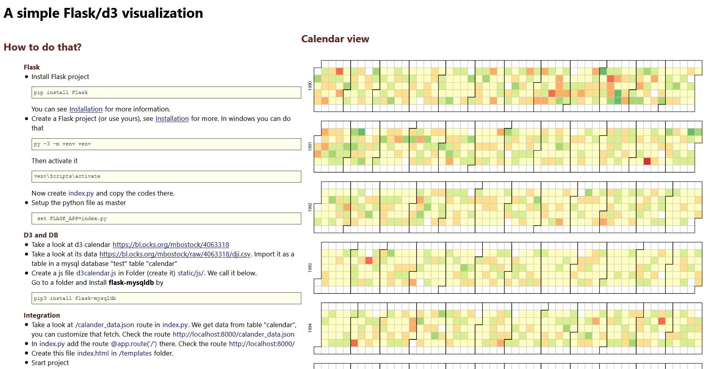

# A-simple-Flask-d3-MySQL-visualization
Creating a minimal simple visualization by the microFramework Flask(python) and D3.js Library using MySql Database

## How to do that?

---
 **Flask**
* Install Flask
    pip install Flask
You can see [Installation](http://flask.pocoo.org/docs/1.0/installation/#install-flask) for more information.

* Create a Flask project (or use yours), see [Installation](http://flask.pocoo.org/docs/1.0/installation/#install-flask) for more. In windows you can do that <body>
```
py -3 -m venv venv
```
Then activate it
```
venv\Scripts\activate
```
Now create  `index.py` and copy the codes there.
* Setup the python file as master
```
  set FLASK_APP=index.py
```

---
**D3 and DB**
* Take a look at d3 calendar [https://bl.ocks.org/mbostock/4063318](https://bl.ocks.org/mbostock/4063318)
* Take a look at its data [https://bl.ocks.org/mbostock/raw/4063318/dji.csv](https://bl.ocks.org/mbostock/raw/4063318/dji.csv). Import it as a table in a MySql database `test` table `calendar`
* Create a js file `d3calendar.js` in Folder (create it) `static/js/`. We call it below.
* Go to a folder and Install _flask-mysqldb_ by
```
pip3 install flask-mysqldb
```

---
**Integration**
* Take a look at `/calander_data.json` route in `index.py`. We get data from table `calendar`, you can customize that fetch. Check the route [http://localhost:8000/calander_data.json](http://localhost:8000/calander_data.json).
* In `index.py` add the route `@app.route('/')` there.
* Create this file `index.html` in `/templates` folder.
* Start project
```
flask run --host=0.0.0.0
```
* Go to [http://127.0.0.1:5000/](http://127.0.0.1:5000/)

---
**Enjoy it**

